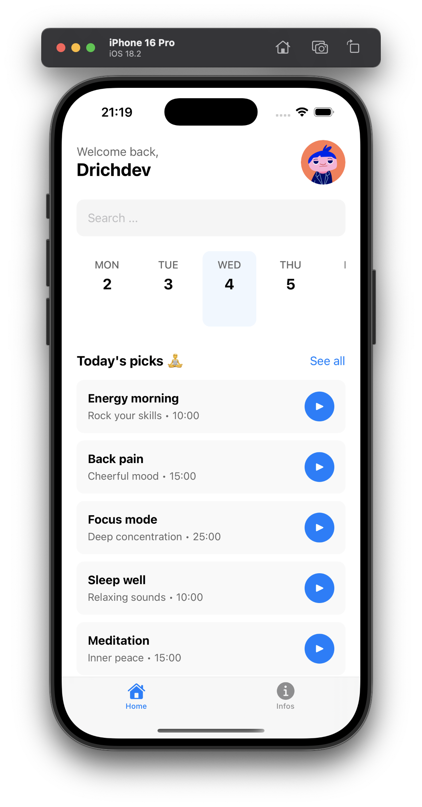

# Yoga app

A mobile application designed to provide therapeutic music experiences based on user moods and preferences, with personalized profiles and daily music recommendations.

##  Features

-  Mood-based music recommendations
-  Daily personalized picks
-  User profile customization
-  Search functionality
-  In-app audio player
-  Responsive design for all devices

## 🛠 Tech Stack

### Core Technologies
- **Expo** - Development platform
- **React Native** - Mobile framework
- **TypeScript** - Type-safe JavaScript
- **Expo Router** - File-based routing

### Key Libraries
| Category        | Libraries                          |
|-----------------|-----------------------------------|
| Navigation      | Expo Router                       |
| State Management| React Context API                 |
| Storage         | @react-native-async-storage       |
| UI Components   | @expo/vector-icons                |
| Audio           | expo-av                           |
| Images          | expo-image                        |
| Animation       | react-native-reanimated           |
